<h1 align="center">Hey there, I'm <a href="https://mr-tooth.github.io/">Junhang Lai</a> 👋</h1>

  Ph.D. candidate in robotics &middot; Humanoid locomotion &middot; Reinforcement learning &middot; Sim-to-real

  
  
  
  
  

## About

I am a Ph.D. candidate in Mechanical Engineering at [Beijing Institute of Technology](https://english.bit.edu.cn/) and a research intern at [the Hong Kong University of Science and Technology (Guangzhou)](https://www.hkust-gz.edu.cn/). I work on motion planning and control for humanoid and legged robots.

My research combines model-based optimization with learning-based control to produce reliable robot motion in simulation and on physical systems.

If you are interested in my work or would like to explore a collaboration, please contact me at [laijunhang.bit@vip.163.com](mailto:laijunhang.bit@vip.163.com).

## Research Focus

- Humanoid and wheel-biped multimodal locomotion planning and control
- Whole-body control, MPC, NMPC, trajectory optimization, and rigid-body dynamics
- Reinforcement learning, imitation learning, motion retargeting, and state estimation
- Robot simulation, system integration, and sim-to-real deployment
- Embodied intelligence and cerebrum-cerebellum coordinated control

## Tech stack

<table>
  <tr>
    <td align="center" width="96">
      
       C++
    </td>
    <td align="center" width="96">
      
       Python
    </td>
    <td align="center" width="96">
      
       PyTorch
    </td>
  </tr>
  <tr>
    <td align="center" width="96">
      
       MATLAB
    </td>
    <td align="center" width="96">
      
       ROS
    </td>
    <td align="center" width="96">
      
       CMake
    </td>
  </tr>
  <tr>
    <td align="center" width="96">
      
       Linux
    </td>
    <td align="center" width="96">
      
       Git
    </td>
    <td align="center" width="96">
      
       Bash
    </td>
  </tr>
</table>

  
  
  
  
  
  

Core tools include C++, Python, MATLAB, PyTorch, ONNX Runtime, Pinocchio, CasADi, Crocoddyl, OCS2, Isaac Gym/Sim, MuJoCo, ROS, EtherCAT, and RTOS-based robot software.

## Open Source

I maintain robotics software and reusable engineering tools through [BitRoboticsLab](https://github.com/bitroboticslab). The projects focus on robot motion, simulation, control, and deployment workflows. Selected research, industry, and open-source work is documented on [my personal website](https://mr-tooth.github.io/).

## GitHub Activity

  
  

  

Cards combine repositories where Mr-tooth is an owner, organization member (including BitRoboticsLab), or collaborator. Language share reflects repository code, not overall technical proficiency.
